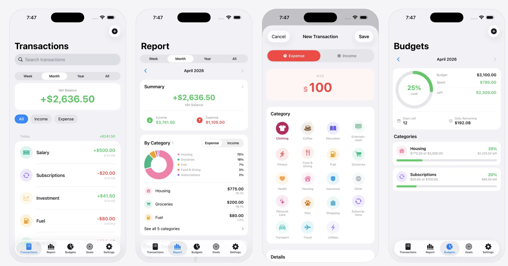

# MoneyMind

**Budget tracker for iPhone and iPad** — log income and expenses, set monthly category budgets, save toward goals, and review spending with charts and exports. Built with SwiftUI; your data stays on the device.

**Available on the App Store:** [MoneyMind: Budget Tracker App](https://apps.apple.com/us/app/moneymind-budget-tracker-app/id6748875528)

<p align="center">
  <a href="https://apps.apple.com/us/app/moneymind-budget-tracker-app/id6748875528">
    
  </a>
</p>

---

## Screenshots

Composite preview of core screens (transactions, report, new transaction, budgets):

<p align="center">
  
</p>

Add more images under [`Screenshots/`](Screenshots/) if you want separate per-screen shots in this section.

---

## Features

| Area | What you get |
|------|----------------|
| **Transactions** | Income & expense entries, categories, search, period filters (week / month / year / all), optional “save to goal” when logging income |
| **Budgets** | Per-category monthly limits, progress and alerts when nearing or over limit |
| **Goals** | Savings targets, contributions, progress charts, savings rate vs. monthly income |
| **Report** | Summary, trends, category breakdown, balance over time; compact home + detail screens with share/export |
| **Settings** | Currency (broad ISO list + locale default on first launch), categories editor, **CSV export**, in-app privacy summary, onboarding replay |

---

## Tech stack

- **SwiftUI** · **Swift 6** · **Observation** (`@Observable` view models, `@MainActor` where appropriate)
- **SQLite** via **[SQLiteData](https://github.com/pointfreeco/sqlite-data)** (GRDB under the hood), file stored under Application Support
- **MVVM** — feature folders under `MoneyMind/Features/…`
- **Swift Dependencies** for database injection at launch

---

## Requirements

- **Xcode** 16.4+ (Swift 6 toolchain)
- **iOS / iPadOS** 18.5+
- Apple Developer account only if you intend to run on device or ship to the App Store

---

## Getting started

1. Clone the repository.
2. Open `MoneyMind.xcodeproj` in Xcode.
3. Wait for **Swift Package Manager** to resolve dependencies (`sqlite-data` and its transitive packages).
4. Select the **MoneyMind** scheme and a simulator or device, then **Run** (⌘R).

No extra bootstrap scripts are required; the app creates its database and runs migrations on first launch.

---

## Project layout

```
MoneyMind/
├── App/                 # App entry, root tab shell
├── Database/            # GRDB migrations, DB URL helpers
├── Features/            # Transactions, Report, Budgets, SavingsGoals, Settings, Categories, Onboarding
├── Models/              # @Table types (Transaction, Category, Budget, Goals, …)
└── Shared/              # Formatters, colors, export CSV, currency catalog, share sheet
```

---

## Data & privacy

- Financial data is stored **locally** in SQLite (`Application Support/MoneyMind/db.sqlite`).
- There is **no in-app account** and **no server** defined in this codebase; export is **user-initiated** (share sheet).
- The shipping app is listed as **Data Not Collected** on the [App Store privacy section](https://apps.apple.com/us/app/moneymind-budget-tracker-app/id6748875528); keep **App Privacy** labels and any hosted **privacy policy** aligned with each release.

---

## Versioning

- Marketing version / bundle ID are set in Xcode (**1.0.0** / `com.appsbay.MoneyMind` at time of writing). Adjust for your team or fork.

---

## License

Copyright © Apps Bay Limited. All rights reserved unless you add an open-source `LICENSE` file for a public fork.

---

## Contributing

Issues and pull requests are welcome if this repo is open to contributions; otherwise treat this README as documentation for internal or personal clones.
